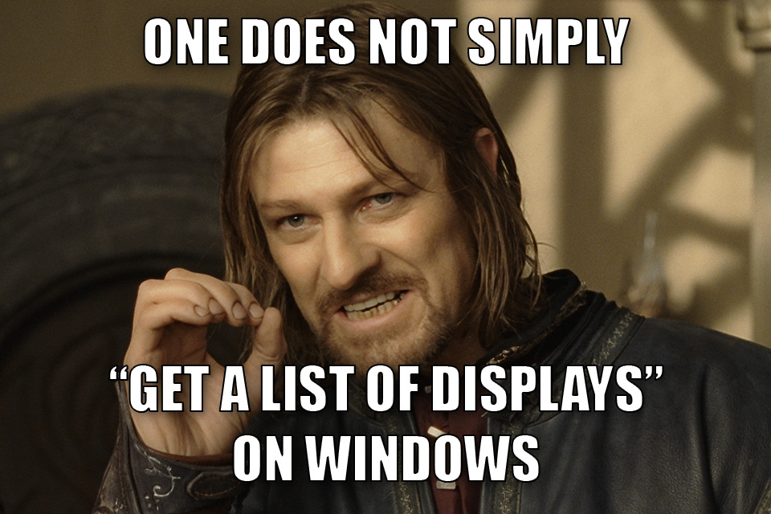

# DisplayProber for Windows (DP4Win) 🛰️

CLI that outputs a list of all connected displays (monitors and TV screens) as
[JSON](./src/ts/schemas/displayprober-win-cpp.schema.json).

Supports Windows 7 SP1 and newer, both 32-bit and 64-bit. \
Tested in Windows 7 SP1, Windows 10, and Windows 11.

This tool returns:

- Friendly display name
- Resolution, working area, rotation, and refresh rate
- Primary vs. extended
- Physical connector type (HDMI, DisplayPort, DVI, VGA, internal, etc.)
- Unique identifiers that are often stable across reboots (not guaranteed)
- Basic EDID properties like manufacturer name, manufacture week/year, physical
  screen dimensions (width and height in MM), serial number, and product code
- Raw EDID bytes

Detects if the following features are _supported_ and/or _actively enabled_:

- HDR10
- Wide/advanced color
- Color space and bit depth
- Min/max luminance
- DPI scaling
- Remote Desktop (RDP)
- Running inside a virtual machine client

_NOTE: For feature detection to work, every device in the chain must support
that feature: OS, GPU, monitor/TV, **and** HDMI/DisplayPort cables._

_NOTE: The terms "Display", "Screen", and "Monitor" are effectively synonyms._

# Usage

```ps1
DisplayProber.exe
```

# Example output

## Windows 10 PC

```jsonc
{
  "displays": [
    // Primary display: Samsung S95C TV
    {
      "friendly_name": "QCQ95S",
      "short_lived_identifier": "\\\\.\\DISPLAY1",
      "monitor_device_path": "\\\\?\\DISPLAY#SAM7346#5&21e6c3e1&0&UID5243153#{e6f07b5f-ee97-4a90-b076-33f57bf4eaa7}",
      "is_primary": true,
      "physical_connector_type": "hdmi",
      "rotation_deg": 0,
      "dpi_scaling_percent": 150,
      "bounds": {
        "x": 0,
        "y": 0,
        "width": 1900,
        "height": 1058,
        "left": 0,
        "right": 1900,
        "top": 0,
        "bottom": 1058,
      },
      "working_area": {
        "x": 0,
        "y": 0,
        "width": 1900,
        "height": 998,
        "left": 0,
        "right": 1900,
        "top": 0,
        "bottom": 998,
      },
      "scan_line_ordering": "progressive",
      "refresh_rate_hz": 60.0,
      "refresh_rate_numerator": 60000,
      "refresh_rate_denominator": 1000,
      "standard_color_info": {
        "bits_per_channel": 8,
        "color_encoding": "rgb",
        "dxgi_color_space": "rgb_full_g22_none_p709",
        "is_hdr_supported": false,
        "is_hdr_enabled": false,
        "min_luminance_nits": 0.009999999776482582,
        "max_luminance_nits": 1499.0,
        "max_full_frame_luminance_nits": 799.0,
      },
      "advanced_color_info": {
        "is_advanced_color_active": false,
        "is_advanced_color_enabled": false,
        "is_advanced_color_force_disabled": false,
        "is_advanced_color_limited_by_policy": false,
        "is_advanced_color_supported": false,
        "is_high_dynamic_range_supported": false,
        "is_high_dynamic_range_user_enabled": false,
        "is_wide_color_enforced": false,
        "is_wide_color_supported": false,
        "is_wide_color_user_enabled": false,
      },
      "edid_info": {
        "manufacturer_vid": "SAM",
        "user_friendly_name": "QCQ95S",
        "max_horizontal_image_size_mm": 1420.0,
        "max_vertical_image_size_mm": 800.0,
        "product_code_id": 7346,
        "serial_number_id": 16780800,
        "week_of_manufacture": 1,
        "year_of_manufacture": 2023,
        "edid_bytes_base64": "AP///////wBMLUZzAA4AAQEhAQOAjlB4CvQRskpBsyY...=",
      },
    },

    // Secondary display: Dell ST2320L monitor
    {
      "friendly_name": "DELL ST2320L",
      "short_lived_identifier": "\\\\.\\DISPLAY2",
      "monitor_device_path": "\\\\?\\DISPLAY#DELF023#5&21e6c3...",
      "is_primary": false,
      "physical_connector_type": "dvi",
      "rotation_deg": 0,
      "dpi_scaling_percent": 150,
      "...": "...",
    },
  ],
}
```

# Feature detection

- Monitor/display device name(s)
- Resolution (`W` × `H`)
- Refresh rate (Hz)
- Bit depth per channel (8, 10, 12, 14, 16)
- DPI scaling (100%, 125%, 150%, etc.)
- Physical connector type
  - VGA
  - DVI
  - HDMI
  - DisplayPort
  - Internal
- Color support:
  - HDR10 supported and active (enabled/disabled)
  - Advanced color supported and active (enabled/disabled)
  - Wide color supported and active (enabled/disabled)
  - Color space: RGB, YCbCr444, YCbCr422, YCbCr420

# Windows version support

- Windows 7 SP1+:
  - Monitor/display names
  - Resolution
  - Refresh rate
  - Physical connector type (HDMI/DVI/VGA/etc.)

- Windows 8.1+:
  - Per-monitor DPI scaling (100%, 125%, 150%, etc.)

- Windows 10 1607+:
  - Per-thread DPI scaling (100%, 125%, 150%, etc.)
  - HDR10 supported and enabled/disabled
  - Advanced color supported and enabled/disabled

- Windows 11 24H2+:
  - Wide color supported and enabled/disabled
  - Active color mode (SDR/WCG/HDR)

# Implementation details

## So you want to enumerate displays on Windows...

...and you want stable, persistent identifiers to uniquely track each monitor/TV
instance across reboots.

Welcome, my friend, to a world of pain.



For your journey into the abyss, you will need:

1. An elf, a dwarf, and a hobbit
2. A stout constitution
3. A licensed professional therapist

To truly capture everything there is to know about all connected displays, you
must use a combination of **five** different Windows API families and
correlate/aggregate the results:

1. **User32** multi-monitor APIs:
   - Classic Win32 display monitor enumeration APIs.
   - `EnumDisplayMonitors()`
   - `GetMonitorInfoW()`
   - `HMONITOR`
2. **Display Configuration** APIs:
   - Topology graph: sources/targets, active paths, modes.
   - `QueryDisplayConfig()`
   - `DisplayConfigGetDeviceInfo()`
3. **DirectX Graphics Infrastructure** adapter/output APIs:
   - Advanced color and luminance characteristics.
   - `CreateDXGIFactory()` (or `CreateDXGIFactory1()`)
   - `IDXGIFactory::EnumAdapters()` (or `EnumAdapters1()`)
   - `IDXGIAdapter::EnumOutputs()`
   - `IDXGIOutput6::GetDesc1()` (populates `DXGI_OUTPUT_DESC1`)
4. **`SetupAPI`** and **PnP device APIs**:
   - Raw EDID bytes, PnP device tree enumeration, device instance IDs, hardware
     IDs, and location paths
   - `SetupDiGetClassDevsW()`
   - `SetupDiEnumDeviceInfo()` (or `SetupDiEnumDeviceInterfaces()`)
   - `SetupDiGetDeviceInstanceIdW()`
   - `SetupDiGetDeviceRegistryPropertyW()` (legacy) or
     `SetupDiGetDevicePropertyW()` (recommended for modern device properties)
   - `SetupDiOpenDevRegKey()` + `RegQueryValueExW()` (commonly used to read
     EDID)
5. **WMI queries**:
   - EDID-derived monitor identity/capabilities and a few connection-related
     fields (e.g., physical connection type: HDMI, DisplayPort, DVI, VGA, etc.)
   - `MI_Session_QueryInstances()`
   - `MI_Operation_GetInstance()`

## Stable identifiers

TODO(acdvorak)

# PowerShell equivalents

In PowerShell v5.1+ on Windows, you can run the following commands to get some
of the same raw underlying data that this C++ CLI returns:

```ps1
# Simple, strongly-typed Windows Forms .NET wrapper around User32
# `EnumDisplayMonitors()`, `GetMonitorInfoW()`, and `HMONITOR`.
Add-Type -AssemblyName System.Windows.Forms; [System.Windows.Forms.Screen]::AllScreens |
  ConvertTo-Json

# GPU adapters.
Get-CimInstance Win32_VideoController |
  ConvertTo-Json

# Windows Plug-n-Play devices.
Get-CimInstance Win32_PnPEntity |
  Where-Object { $_.PNPClass -in @('Monitor','Display') } |
  ConvertTo-Json

# Parsed EDID "Basic Display Parameters" block.
Get-CimInstance -Namespace root\wmi WmiMonitorBasicDisplayParams |
  ConvertTo-Json

# Physical connector type (HDMI, DisplayPort, DVI, VGA, etc.).
Get-CimInstance -Namespace root\wmi WmiMonitorConnectionParams |
  ConvertTo-Json

# Parsed EDID "Video Input Definition" block.
Get-CimInstance -Namespace root\wmi WmiMonitorDescriptorMethods |
  ConvertTo-Json

# Parsed EDID "Vendor/Product Identification" block.
Get-CimInstance -Namespace root\wmi WmiMonitorID |
  ConvertTo-Json
```

# Related tools

Native binaries:

- [NirSoft DumpEDID](https://www.nirsoft.net/utils/dump_edid.html)
  - Reads and parses EDID data
  - `DumpEDID.exe -a > path/to/output.txt`
- [NirSoft MonitorInfoView](https://www.nirsoft.net/utils/monitor_info_view.html)
  - Reads and parses EDID data
  - `MonitorInfoView.exe /HideInactiveMonitors 1 /sxml path/to/output.xml`
- [NirSoft MultiMonitorTool](https://www.nirsoft.net/utils/multi_monitor_tool.html)
  - Prints most of the basic facts that Windows knows about your monitors:
    resolution, refresh rate, DPI scaling, rotation, position
  - `MultiMonitorTool.exe /HideInactiveMonitors 1 /sxml path/to/output.xml`
- [NirSoft ControlMyMonitor](https://www.nirsoft.net/utils/control_my_monitor.html)
  - Prints a few basic details about your monitors, and lets you query/control
    their brightness, contrast, etc. via DDC/CI
  - `ControlMyMonitor.exe /smonitors path/to/output.txt`
- [`edid-decode`](https://git.linuxtv.org/v4l-utils.git/tree/utils/edid-decode)
  - Reference-quality EDID and DisplayID parser
  - Nominally cross-platform, but harder to compile on Windows/macOS
  - [Windows port of `edid-decode`](https://github.com/a1ive/edid-decode)
    ```ps1
    edid-decode.exe /MONITOR0
    edid-decode.exe path/to/edid.bin
    edid-decode.exe /MONITOR0 path/to/edid.bin
    ```

# Reference implementations

Basic display properties and enumeration:

- Chromium:
  - [`ui/display/win/display_info.cc`](https://chromium.googlesource.com/chromium/src/+/refs/heads/main/ui/display/win/display_info.cc)
  - [`ui/display/win/screen_win.cc`](https://chromium.googlesource.com/chromium/src/+/master/ui/display/win/screen_win.cc)
- Looking Glass:
  [`Windows/capture/DXGI/src/dxgi.c`](https://github.com/gnif/LookingGlass/blob/7f31ecf5e/host/platform/Windows/capture/DXGI/src/dxgi.c)
- Windows Classic Samples:
  [`DXGIDesktopDuplication/cpp/DuplicationManager.cpp`](https://github.com/microsoft/Windows-classic-samples/blob/0b4e48a88/Samples/DXGIDesktopDuplication/cpp/DuplicationManager.cpp)
- WinUIEx:
  [`MonitorInfo.cs`](https://github.com/dotMorten/WinUIEx/blob/main/src/WinUIEx/MonitorInfo.cs)

HDR:

- [AutoActions: `HDRController.cpp`](https://github.com/Codectory/AutoActions/blob/main/Source/HDRController/HDRController/HDRController.cpp)
- [HDR Tray: `HDR.cpp`](https://github.com/res2k/HDRTray/blob/main/common/HDR.cpp)

EDID and DisplayID parsing:

- `libdisplay-info`:
  - EDID and DisplayID parsing library written in C
  - [freedesktop.org source code](https://gitlab.freedesktop.org/emersion/libdisplay-info)
    - [API documentation](https://emersion.pages.freedesktop.org/libdisplay-info/)
    - [`edid-decode` subproject branch](https://gitlab.freedesktop.org/emersion/libdisplay-info/-/tree/edid-decode-subproject)
    - [`wasm` branch](https://gitlab.freedesktop.org/emersion/libdisplay-info/-/tree/wasm)
  - [LineageOS fork](https://github.com/LineageOS/android_external_libdisplay-info-upstream)
  - [Chromium mirror](https://chromium.googlesource.com/external/gitlab.freedesktop.org/emersion/libdisplay-info/)
  - [GitHub mirror](https://github.com/gjasny/v4l-utils)

# Development

## Prerequisites

- Windows 10 or newer
- PowerShell v5.1 or newer

Run:

```ps1
./deps.ps1
```

This will install all necessary dependencies:

- [`winget`](https://aka.ms/winget)
- [CMake](https://cmake.org/)
- [VS 2022 Build Tools installer](https://learn.microsoft.com/en-us/visualstudio/releases/2022/release-history#fixed-version-bootstrappers)
  - MSVC v143 - VS 2022 C++ x64/86 build tools
  - C++ CMake tools for Windows
  - Windows 11 SDK v10.26100
  - MSBuild

## Building

```ps1
./build.ps1 [-Debug|-Release] [-x64|-x86|-Both]
```

## Running

```ps1
./run.ps1
```

## Unit tests

```ps1
./test.ps1
```

## Helper scripts

Print the OS name/version, PowerShell name/version, and a list of installed .NET
runtimes:

```ps1
./version.ps1
```

Enumerate display properties using a combination of tools (DisplayProber,
NirSoft utilities, PowerShell scripts), and write their stdout to disk:

```ps1
./dump.ps1
```
