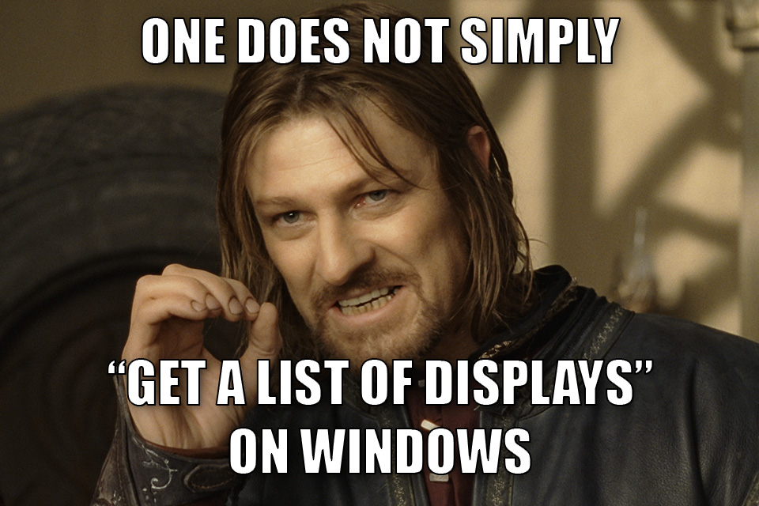

# DisplayProber for Windows (DP4Win) 🛰️

CLI that outputs a list of all connected displays (monitors and TV screens) as
[JSON](./src/ts/schemas/displayprober-win-cpp.schema.json).

- Supports Windows 7 SP1 and newer, both 32-bit and 64-bit.
- Tested in Windows 7 SP1, Windows 10, and Windows 11.

This tool returns:

- Friendly display name
- Resolution, working area, rotation, and refresh rate
- Primary vs. extended
- Physical connector type (HDMI, DisplayPort, DVI, VGA, internal, etc.)
- Unique identifiers that are often stable across reboots (not guaranteed)
- Basic EDID properties like manufacturer name, manufacture week/year, physical
  screen dimensions (width and height in MM), serial number, and product code
- Raw EDID bytes

Detects if the following features are _supported_ and/or _actively enabled_:

- HDR10
- Wide/advanced color
- Color space and bit depth
- Min/max luminance
- DPI scaling
- Remote Desktop (RDP)
- Running inside a virtual machine client

_NOTE: For feature detection to work, every device in the chain must support
that feature: OS, GPU, monitor/TV, **and** HDMI/DisplayPort cables._

_NOTE: The terms "Display", "Screen", and "Monitor" are effectively synonyms._

# Contributing

This tool is a passion project I wrote in my spare time. It's a hobby, not a
job.

Issues and pull requests are welcome, but don't be offended if you don't receive
a timely response. It probably just means I'm busy with family, work, and life.

# Versioning

This project does not use semver (yet).

Until it reaches stability, expect minor version bumps to have breaking changes.

Specifically, the shape of JSON objects and the names of JSON fields will likely
differ between version `1.x.0` and `1.y.0`. I may also add or remove fields, or
change the format of unique identifier strings.

# Usage

```ps1
DisplayProber.exe
```

# Example output

## Windows 10 PC

```jsonc
{
  "displays": [
    // Primary display: Samsung S95C TV
    {
      "friendly_name": "QCQ95S",
      "short_lived_identifier": "\\\\.\\DISPLAY1",
      "monitor_device_path": "\\\\?\\DISPLAY#SAM7346#5&21e6c3e1&0&UID5243153#{e6f07b5f-ee97-4a90-b076-33f57bf4eaa7}",
      "is_primary": true,
      "physical_connector_type": "hdmi",
      "rotation_deg": 0,
      "dpi_scaling_percent": 150,
      "bounds": {
        "x": 0,
        "y": 0,
        "width": 1900,
        "height": 1058,
        "left": 0,
        "right": 1900,
        "top": 0,
        "bottom": 1058,
      },
      "working_area": {
        "x": 0,
        "y": 0,
        "width": 1900,
        "height": 998,
        "left": 0,
        "right": 1900,
        "top": 0,
        "bottom": 998,
      },
      "scan_line_ordering": "progressive",
      "refresh_rate_hz": 60.0,
      "refresh_rate_numerator": 60000,
      "refresh_rate_denominator": 1000,
      "standard_color_info": {
        "bits_per_channel": 8,
        "color_encoding": "rgb",
        "dxgi_color_space": "rgb_full_g22_none_p709",
        "is_hdr_supported": false,
        "is_hdr_enabled": false,
        "min_luminance_nits": 0.009999999776482582,
        "max_luminance_nits": 1499.0,
        "max_full_frame_luminance_nits": 799.0,
      },
      "advanced_color_info": {
        "is_advanced_color_active": false,
        "is_advanced_color_enabled": false,
        "is_advanced_color_force_disabled": false,
        "is_advanced_color_limited_by_policy": false,
        "is_advanced_color_supported": false,
        "is_high_dynamic_range_supported": false,
        "is_high_dynamic_range_user_enabled": false,
        "is_wide_color_enforced": false,
        "is_wide_color_supported": false,
        "is_wide_color_user_enabled": false,
      },
      "edid_info": {
        "manufacturer_vid": "SAM",
        "user_friendly_name": "QCQ95S",
        "max_horizontal_image_size_mm": 1420.0,
        "max_vertical_image_size_mm": 800.0,
        "product_code_id": 7346,
        "serial_number_id": 16780800,
        "week_of_manufacture": 1,
        "year_of_manufacture": 2023,
        "edid_bytes_base64": "AP///////wBMLUZzAA4AAQEhAQOAjlB4CvQRskpBsyY...=",
      },
    },

    // Secondary display: Dell ST2320L monitor
    {
      "friendly_name": "DELL ST2320L",
      "short_lived_identifier": "\\\\.\\DISPLAY2",
      "monitor_device_path": "\\\\?\\DISPLAY#DELF023#5&21e6c3...",
      "is_primary": false,
      "physical_connector_type": "dvi",
      "rotation_deg": 0,
      "dpi_scaling_percent": 150,
      "...": "...",
    },
  ],
}
```

# Feature detection

- Monitor/display device name(s)
- Resolution (`W` × `H`)
- Refresh rate (Hz)
- Bit depth per channel (8, 10, 12, 14, 16)
- DPI scaling (100%, 125%, 150%, etc.)
- Physical connector type
  - VGA
  - DVI
  - HDMI
  - DisplayPort
  - Internal
- Color support:
  - HDR10 supported and active (enabled/disabled)
  - Advanced color supported and active (enabled/disabled)
  - Wide color supported and active (enabled/disabled)
  - Color space: RGB, YCbCr444, YCbCr422, YCbCr420

# Windows version support

- Windows 7 SP1+:
  - Monitor/display names
  - Resolution
  - Refresh rate
  - Physical connector type (HDMI/DVI/VGA/etc.)

- Windows 8.1+:
  - Per-monitor DPI scaling (100%, 125%, 150%, etc.)

- Windows 10 1607+:
  - Per-thread DPI scaling (100%, 125%, 150%, etc.)
  - HDR10 supported and enabled/disabled
  - Advanced color supported and enabled/disabled

- Windows 11 24H2+:
  - Wide color supported and enabled/disabled
  - Active color mode (SDR/WCG/HDR)

# Implementation details

## So you want to enumerate displays on Windows...

...and you want stable, persistent identifiers to uniquely track each monitor/TV
instance across reboots.

Welcome, my friend, to a world of pain.



For your journey into the abyss, you will need:

1. An elf, a dwarf, and a hobbit
2. A stout constitution
3. A licensed professional therapist

To truly capture everything there is to know about all connected displays, you
must use a combination of **five** different Windows API families and
correlate/aggregate the results:

### 1. **GDI** and **User32** multi-monitor APIs

Classic Win32 monitor enumeration APIs.

⛳️ Windows 2000 and newer.

GDI =
[Graphics Device Interface](https://learn.microsoft.com/en-us/windows/win32/gdi/windows-gdi).

Primary API surface:

- `EnumDisplayMonitors()`
- `EnumDisplayDevices()`
  - Must be called _twice_ to find physical monitors: first to enumerate
    adapters, then again passing the adapter's `DeviceName` to enumerate its
    attached monitors.
- `EnumDisplaySettings()` / `EnumDisplaySettingsEx()`
- `MonitorFromWindow()`
- `GetMonitorInfo()` / `GetMonitorInfoW()` (populate
  `MONITORINFO`/`MONITORINFOEX` for an `HMONITOR`)

These APIs are old and desktop-centric. They expose things like:

- Session-scoped adapter "names" such as `\\.\DISPLAY1`.
  - _This string is the correlation key used to join GDI with DXGI and CCD._
- Monitor names attached to a GDI adapter
- Monitor rectangles in virtual desktop coordinates
- Current desktop modes
- Primary monitor status

GDI is useful when you care about what the Windows desktop currently looks like
from the app/UI point of view.

But GDI has limitations:

- It is not the best source of truth for modern topology
- It can be awkward for clone scenarios
- It does not model the full source-to-target path structure directly
- Some identifiers are more session-oriented or presentation-oriented than
  hardware/topology-oriented

### 2. **SetupAPI** and **PnP device** APIs

Classic Win32 Plug-n-Play device tree enumeration APIs.

⛳️ Windows 2000 and newer.

Returns raw EDID bytes, hardware IDs, device instance IDs, and location paths.

Primary API surface:

- `SetupDiEnumDeviceInfo()`
  - Enumerate _physical_ devices/devnodes in a set.
  - `SP_DEVINFO_DATA`
- `SetupDiEnumDeviceInterfaces()`
  - Enumerates device interfaces exposed by a device/interface class.
  - `SP_DEVICE_INTERFACE_DATA`
- `SetupDiGetClassDevsW()`
- `SetupDiGetDeviceInstanceIdW()`
- `SetupDiGetDeviceInterfaceDetailW()`
  - Returns the interface path and related `SP_DEVINFO_DATA`.
  - The device interface path (e.g., `\\?\DISPLAY#...`) is the _correlation key_
    used to join SetupAPI physical devices with CCD targets.
- `SetupDiGetDeviceRegistryPropertyW()`
  - Windows 2000 and newer
- `SetupDiGetDevicePropertyW()`
  - Vista RTM and newer
  - Recommended for modern device properties
- `SetupDiOpenDevRegKey()` + `RegQueryValueExW()`
  - Used to read EDID bytes.

### 3. **CCD Display Configuration** APIs

Modern path-based display topology graph: sources/targets, active paths, modes.

⛳️ Windows 7 RTM and newer.

CCD =
[Connecting and Configuring Display](https://learn.microsoft.com/en-us/windows-hardware/drivers/display/ccd-apis).

Primary API surface:

- `GetDisplayConfigBufferSizes()`
- `QueryDisplayConfig()`
- `DisplayConfigGetDeviceInfo()`
- `SetDisplayConfig()`

CCD is path-based. It models:

- Adapters (GPUs)
- Sources (display pipelines/viewports managed by the OS)
- Targets (physical outputs/connectors on the GPU)
- Paths between them
- Source and target modes
- Active vs. inactive paths
- Clone / extend topology
- Target output technology
- Rotation, scaling, refresh, scanline ordering
- Friendly monitor names and target device names via
  `DISPLAYCONFIG_DEVICE_INFO_*` queries

**💡 CCD acts as the central bridge for correlating APIs:**

- `DISPLAYCONFIG_SOURCE_DEVICE_NAME.viewGdiDeviceName` links a CCD source back
  to GDI and DXGI.
- `DISPLAYCONFIG_TARGET_DEVICE_NAME.monitorDevicePath` links a CCD target to
  SetupAPI/PnP.

This is the API family you use when you want the real display topology, not just
the desktop view.

### 4. **WMI queries**

EDID-derived monitor identity/capabilities and a few connection-related fields
(e.g., physical connection type: HDMI, DisplayPort, DVI, VGA, etc.).

⛳️ Windows 7 SP1 (with WMF 3.0) and newer.

Primary API surface:

- `MI_Session_QueryInstances()`
- `MI_Operation_GetInstance()`

The WMI `InstanceName` property loosely matches the SetupAPI PnP device instance
ID, typically appended with a `_0` suffix.

### 5. **DirectX Graphics Infrastructure** adapter/output APIs

Advanced color and luminance characteristics.

⛳️ Windows Vista RTM and newer.

Primary API surface:

- `CreateDXGIFactory()`
  - Vista RTM and newer
  - Direct3D 10
  - DXGI 1.0
- `CreateDXGIFactory1()`
  - Vista SP2 and newer
  - Direct3D 11
  - DXGI 1.1
- `IDXGIFactory::EnumAdapters()` (or `EnumAdapters1()`)
  - Used to iterate through all display subsystems, including both hardware and
    software adapters, and those with or without outputs attached
  - The adapter displaying the desktop primary is returned first (index zero).
    Other adapters with outputs are returned next. Adapters without outputs are
    returned last.
- `IDXGIAdapter::EnumOutputs()`
- `IDXGIOutput6::GetDesc1()` (populates `DXGI_OUTPUT_DESC1`)
  - Windows 10 and newer; on older systems, fall back to `IDXGIOutput::GetDesc()`.
  - Returns HDR information.
  - `DXGI_OUTPUT_DESC.DeviceName` matches the GDI `szDevice` (e.g.,
    `\\.\DISPLAY1`), linking DXGI outputs to GDI adapters and CCD sources.

## Stable identifiers

TODO(acdvorak)

[Chromium `win/screen_win.cc`](https://chromium.googlesource.com/chromium/src/+/5331222/ui/display/win/screen_win.cc#557):

> Gauge IDs derived from `DISPLAY_DEVICE`'s `DeviceID` and `DeviceKey`.
> TODO([crbug.com/40233353](https://crbug.com/40233353)): Derive more stable and
> sufficiently unique IDs.

[WebRTC `win/screen_capture_utils.cc`](https://webrtc.googlesource.com/src/+/c0fd2e0/modules/desktop_capture/win/screen_capture_utils.cc?pli=1#184):

> `DeviceKey` is documented as reserved, but it actually contains the registry
> key for the device and is unique for each monitor, while `DeviceID` is not.

# PowerShell equivalents

In PowerShell v5.1+ on Windows 8 and newer, you can run the following commands
to get much of the same underlying data that this C++ CLI returns:

```ps1
# Simple, strongly-typed Windows Forms .NET wrapper around User32
# `EnumDisplayMonitors()`, `GetMonitorInfoW()`, and `HMONITOR`.
Add-Type -AssemblyName System.Windows.Forms; [System.Windows.Forms.Screen]::AllScreens |
  ConvertTo-Json

# GPU adapters.
Get-CimInstance Win32_VideoController |
  ConvertTo-Json

# Windows Plug-n-Play devices.
Get-CimInstance Win32_PnPEntity |
  Where-Object { $_.PNPClass -in @('Monitor','Display') } |
  ConvertTo-Json

# Parsed EDID "Basic Display Parameters" block.
Get-CimInstance -Namespace root\wmi WmiMonitorBasicDisplayParams |
  ConvertTo-Json

# Physical connector type (HDMI, DisplayPort, DVI, VGA, etc.).
Get-CimInstance -Namespace root\wmi WmiMonitorConnectionParams |
  ConvertTo-Json

# Parsed EDID "Video Input Definition" block.
Get-CimInstance -Namespace root\wmi WmiMonitorDescriptorMethods |
  ConvertTo-Json

# Parsed EDID "Vendor/Product Identification" block.
Get-CimInstance -Namespace root\wmi WmiMonitorID |
  ConvertTo-Json
```

# Related tools

Native binaries:

- [NirSoft DumpEDID](https://www.nirsoft.net/utils/dump_edid.html)
  - Reads and parses EDID data
  - `DumpEDID.exe -a > path/to/output.txt`
- [NirSoft MonitorInfoView](https://www.nirsoft.net/utils/monitor_info_view.html)
  - Reads and parses EDID data
  - `MonitorInfoView.exe /HideInactiveMonitors 1 /sxml path/to/output.xml`
- [NirSoft MultiMonitorTool](https://www.nirsoft.net/utils/multi_monitor_tool.html)
  - Prints most of the basic facts that Windows knows about your monitors:
    resolution, refresh rate, DPI scaling, rotation, position
  - `MultiMonitorTool.exe /HideInactiveMonitors 1 /sxml path/to/output.xml`
- [NirSoft ControlMyMonitor](https://www.nirsoft.net/utils/control_my_monitor.html)
  - Prints a few basic details about your monitors, and lets you query/control
    their brightness, contrast, etc. via DDC/CI
  - `ControlMyMonitor.exe /smonitors path/to/output.txt`
- [`edid-decode`](https://git.linuxtv.org/v4l-utils.git/tree/utils/edid-decode)
  - Reference-quality EDID and DisplayID parser
  - Nominally cross-platform, but harder to compile on Windows/macOS
  - [Windows port of `edid-decode`](https://github.com/a1ive/edid-decode)
    ```ps1
    edid-decode.exe /MONITOR0
    edid-decode.exe path/to/edid.bin
    edid-decode.exe /MONITOR0 path/to/edid.bin
    ```

# Reference implementations

Basic display properties and enumeration:

- Chromium:
  - [`ui/display/win/display_info.cc`](https://chromium.googlesource.com/chromium/src/+/refs/heads/main/ui/display/win/display_info.cc)
  - [`ui/display/win/screen_win.cc`](https://chromium.googlesource.com/chromium/src/+/master/ui/display/win/screen_win.cc)
- Looking Glass:
  [`Windows/capture/DXGI/src/dxgi.c`](https://github.com/gnif/LookingGlass/blob/7f31ecf5e/host/platform/Windows/capture/DXGI/src/dxgi.c)
- Windows Classic Samples:
  [`DXGIDesktopDuplication/cpp/DuplicationManager.cpp`](https://github.com/microsoft/Windows-classic-samples/blob/0b4e48a88/Samples/DXGIDesktopDuplication/cpp/DuplicationManager.cpp)
- WinUIEx:
  [`MonitorInfo.cs`](https://github.com/dotMorten/WinUIEx/blob/main/src/WinUIEx/MonitorInfo.cs)
- WebRTC:
  [`desktop_capture/win/screen_capture_utils.cc`](https://webrtc.googlesource.com/src/+/refs/heads/main/modules/desktop_capture/win/screen_capture_utils.cc)

HDR:

- [AutoActions: `HDRController.cpp`](https://github.com/Codectory/AutoActions/blob/main/Source/HDRController/HDRController/HDRController.cpp)
- [HDR Tray: `HDR.cpp`](https://github.com/res2k/HDRTray/blob/main/common/HDR.cpp)

EDID and DisplayID parsing:

- `libdisplay-info`:
  - EDID and DisplayID parsing library written in C
  - [freedesktop.org source code](https://gitlab.freedesktop.org/emersion/libdisplay-info)
    - [API documentation](https://emersion.pages.freedesktop.org/libdisplay-info/)
    - [`edid-decode` subproject branch](https://gitlab.freedesktop.org/emersion/libdisplay-info/-/tree/edid-decode-subproject)
    - [`wasm` branch](https://gitlab.freedesktop.org/emersion/libdisplay-info/-/tree/wasm)
  - [LineageOS fork](https://github.com/LineageOS/android_external_libdisplay-info-upstream)
  - [Chromium mirror](https://chromium.googlesource.com/external/gitlab.freedesktop.org/emersion/libdisplay-info/)
  - [GitHub mirror](https://github.com/gjasny/v4l-utils)

Microsoft Windows Classic Samples:

- [DXGI desktop duplication sample](https://github.com/microsoft/Windows-classic-samples/tree/0b4e48a88ba446f3d87c5f7df12b33a74899a1e1/Samples/DXGIDesktopDuplication)
- [Dynamic DPI sample](https://github.com/microsoft/Windows-classic-samples/tree/0b4e48a88ba446f3d87c5f7df12b33a74899a1e1/Samples/DynamicDPI)
- [Per-Monitor Aware WPF Sample](https://github.com/microsoft/Windows-classic-samples/tree/0b4e48a88ba446f3d87c5f7df12b33a74899a1e1/Samples/PerMonitorDPIAware)

# Development

## Prerequisites

- Windows 10 or newer
- PowerShell v5.1 or newer

Run:

```ps1
./deps.ps1
```

This will install all necessary dependencies:

- [`winget`](https://aka.ms/winget)
- [CMake](https://cmake.org/)
- [VS 2022 Build Tools installer](https://learn.microsoft.com/en-us/visualstudio/releases/2022/release-history#fixed-version-bootstrappers)
  - MSVC v143 - VS 2022 C++ x64/86 build tools
  - C++ CMake tools for Windows
  - Windows 11 SDK v10.26100
  - MSBuild

## Building

```ps1
./build.ps1 [-Debug|-Release] [-x64|-x86|-Both]
```

## Running

```ps1
./run.ps1
```

## Unit tests

```ps1
./test.ps1
```

## Helper scripts

Print the OS name/version, PowerShell name/version, and a list of installed .NET
runtimes:

```ps1
./version.ps1
```

Enumerate display properties using a combination of tools (DisplayProber,
NirSoft utilities, PowerShell scripts), and write their stdout to disk:

```ps1
./dump.ps1
```
